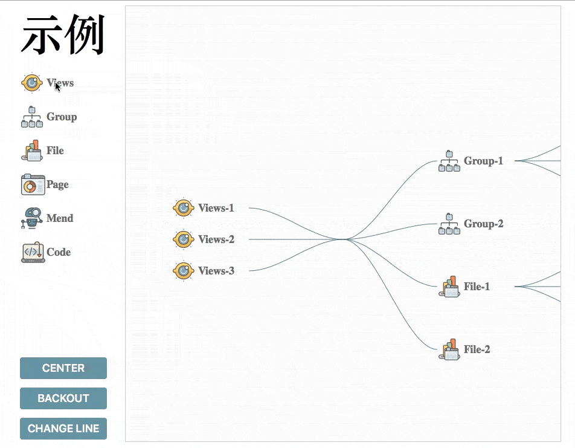
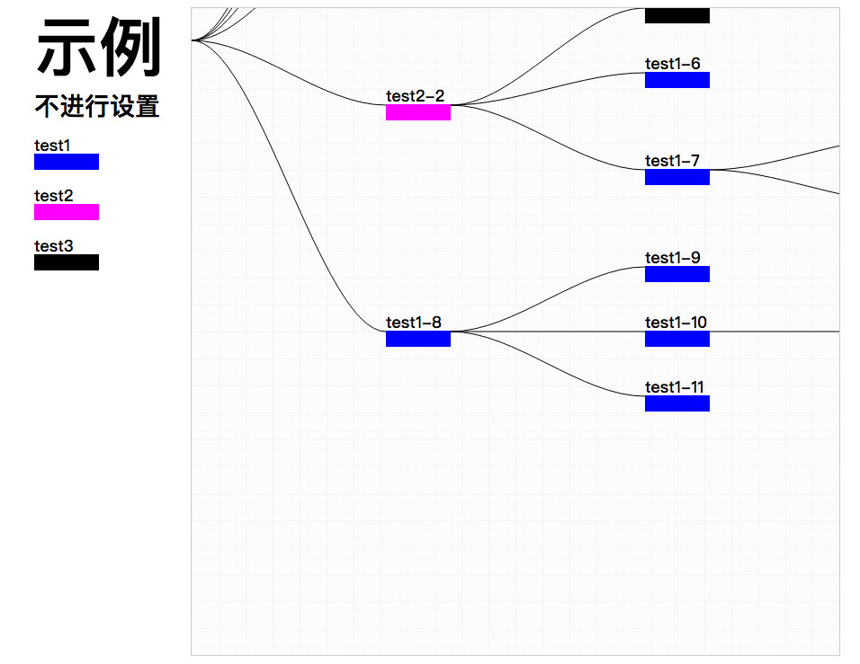

## SDT 是什么？

SDT 是 SVG Drag Tree 的缩写，一个可以通过拖放 SVG 图标，来生成拥有树形结构的视图与相应数据的前端组件。该组件不依赖任何其它库或框架，同时在样式上留给了用户极大的自由（因此，示例并不代表其最终样式（例如连线可以设置为直线）），其 .min.js 格式文件大小约为 13kb。

### 示例 [example](https://aute.github.io/SVGDragTree/) 


## 引入方法

通过 &lt;script&gt; 标签引入，若此标签放置于头部，则需为其添加并设置 defer="defer" 属性  
*注: 若通需过其他的 JS 脚本（如下面的 exampleScript.js）对组件进行设置或调用，则此 JS 文件需在 SDT.js 后引入* 
```html
<head>
	...
	<script src="SDT.js" defer="defer" type="text/javascript" charset="utf-8"></script>
	<script src="exampleScript.js" defer="defer" type="text/javascript" charset="utf-8"></script>
	...
</head>
```
在 .html 文件中，可拖动的所有 SVG 图标被一个 class = "sdt-drag-element-lis" 的 &lt;div &gt; 标签包围，每个SVG图标分别被一个 class="sdt-drag-element" 的 &lt;div &gt; 标签包围  
*注：class="sdt-drag-element" 的 &lt;div&gt; 标签必须拥有 data-sdt-type 属性，属性值为字符串，用以说明此图标的类型*
```html
<div class="sdt-drag-element-lis">
	<div class="sdt-drag-element" data-sdt-type="icon-1">
		<svg>...</svg>
	</div>
	<div class="sdt-drag-element" data-sdt-type="icon-2">
		<svg>...</svg>
	</div>
	<div class="sdt-drag-element" data-sdt-type="icon-3">
		<svg>...</svg>
	</div>
	...
</div>
```

在 .html 文件中，目标画布被一个 class="sdt-canvas" 的 &lt;div&gt; 标签包围，此标签的宽和高决定了目标画布的宽和高。目标画布本身是一个 id="sdt-drop-canvas" 的 &lt;svg&gt;标签
```html
<div class="sdt-canvas">
	<svg id="sdt-drop-canvas" width="100%" height="100%">...</svg>
</div>
```

## 配置方法
### 不进行配置： 
若不进行配置，则组件默认所有元素均可放置于所有元素之上，默认所有元素放置于右边树，元素间的上下边距为元素的高度，元素间的连线方式为贝塞尔曲线，连线颜色为#999，树的中心位于画布左上角



### 不进行配置示例 [example](https://aute.github.io/SVGDragTree/noSet.html)

### 配置方法 1: 直接在 .html 文件中进行配置

#### 元素配置:
在每个可拖动SVG图标外层的 &lt;div&gt;（class="sdt-drag-element"） 标签中通过 data-sdt-eleset-* 进行元素配置 
* **data-sdt-eleset-dropswitch** 
值为 true 或 false 
当值为 true 时元素可直接放置于画布
* **data-sdt-eleset-leanright** 
值为 true 或 false 
当值为 true 时元素默认放置于右侧树
* **data-sdt-eleset-foresidetype** 
值为一个字符串 type 间由 "," 隔开 
当值为空时，则任何元素都将不接受其的放置；当值为 all 时所有元素都接受其放置；当值为合法 type 串时，type 串中所代表的类型元素将接受其放置
```html
<div class="sdt-drag-element"
data-sdt-type="icon-1"
data-sdt-eleset-dropswitch=true
data-sdt-eleset-leanright=true
data-sdt-eleset-foresidetype="icon-1,icon-2">
	<svg>...</svg>
</div>
```

#### 目标画布配置:
在 class="svg-canvas" 的 &lt;div&gt; 标签中通过 data-sdt-eleset-* 进行目标画布配置 
* **data-sdt-eleset-lineType** 
值为 "straight" 或 "bessel" 
当值为 "straight" 时元素间连线方式为直线；当值为 "bessel" 时元素间连线方式为贝塞尔曲线；
* **data-sdt-eleset-lineColor** 
值为颜色色值字符串 
连线颜色为此色值
* **data-sdt-eleset-treecenterX** 
值为数字（不带单位，非字符串） 
树的中心 X 坐标
* **data-sdt-eleset-treecenterY** 
值为数字（不带单位，非字符串） 
树的中心 Y 坐标
* **data-sdt-eleset-margin** 
值为数字（不带单位，非字符串） 
元素的上下边距 
```html
<div class="svg-canvas"
data-sdt-eleset-lineType="bessel"
data-sdt-eleset-lineColor="#900"
data-sdt-eleset-treecenterX="360"
data-sdt-eleset-treecenterY="360"
data-sdt-eleset-margin="8">
	<svg id="dropCanvas" width="100%" height="100%">...</svg>
</div>
```
### 配置方法 2: 在新的 JS 文件中进行配置

声明一个对象 set_o 对象字面量为  

*注意： SDTTreeElements 是数组对象，而 SDTTreeSet 是对象*
```javaScript
var set_o = {
	"SDTTreeElements": [],
	"SDTTreeSet": {}
	};
```

#### 元素配置: 
在 SDTTreeElements 数组中，每一项为一个对象，每个对象的: 
* **type** 属性 
值为字符串 
表示元素类型
* **dropswitch** 属性 
值为 true 或 false 
当值为 true 时元素可直接放置于画布
* **leanRight** 
值为 true 或 false 
当值为 true 时元素默认放置于右侧树
* **foresideType** 
值为一个数组 
当数组为空时，则任何元素都将不接受其的放置；当数组有元素值为 all 时所有元素都接受其放置；当数组元素值为合法 type 时，其 type 所对应元素接受其放置
```javaScript
var set_o = {
"SDTTreeElements": [
	{
		"type": "icon-1", 
		"dropSwitch": true, 
		"foresideType": ["icon-1","icon-2"], 
		"leanRight": false
	},{
		"type": "icon-2",
		"dropSwitch": true,
		"foresideType": ["root", "icon-2"], 
		"leanRight": false
	},{
		"type": "icon-2",
		"dropSwitch": true,
		"foresideType": ["all"], 
		"leanRight": false
	}
],
"SDTTreeSet": {...}
};
```
#### 目标画布配置:

在 SDTTreeSet 对象中，每一个属性: 
* **lineType** 
值为 "straight" 或 "bessel" 
当值为 "straight" 时元素间连线方式为直线；当值为 "bessel" 时元素间连线方式为贝塞尔曲线；
* **lineColor** 
值为颜色色值字符串 
连线颜色为此色值
* **treecenterX** 
值为数字（不带单位，非字符串） 
树的中心 X 坐标
* **treecenterY** 
值为数字（不带单位，非字符串） 
树的中心 Y 坐标
* **treeEleMargin** 
值为数字（不带单位，非字符串） 
元素的上下边距
```javaScript
var set_o = {
	"SDTTreeElements": [...],
	"SDTTreeSet": {
		"lineType": "bessel",
		"lineColor": "#f00",
		"treeCenterX": "360",
		"treeCenterY": "360",
		"treeEleMargin": "16"
		}
};
```

## API
### SDT.SVGDragComponent() 
对组件进行配置，接受一个参数，参数类型为对象，对象字面量应符合 “配置方法 2: 在新的 JS 文件中进行配置” 中所规定的格式
```javaScript
SDT.SVGDragComponent(set_o);
```
### SDT.backCenter() 
返回画布中心，不接受参数
```javaScript
document.getElementById("btn-1").addEventListener("click", function () {
	SDT.backCenter();
});
```

### SDT.removeELe() 
删除元素，接受一个参数，参数类型为数组，数组元素应为要删除的元素的 id 
注: 若不传入参数则删除最近放置的元素
```javaScript
document.getElementById("btn-2").addEventListener("click", function () {
	var rLis =["icon-2-3","icon-3-1","icon-1-1"]
	SDT.removeELe(rLis);
});

document.getElementById("btn-3").addEventListener("click", function () {
	SDT.removeELe();
});
```

### SDT.returnTree() 
返回树，接受一个参数，参数类型为值为 true 或 false 的变量，若值为 true 则返回精简树（元素只包含 id 、 name 、 foresideObjId 、 childEles 信息），不可用于重绘；若值为 false 则返回完整树，完整树可用于重绘
注: 重绘要求有页面有图标信息，即相应的 class = "sdt-drag-element-lis" 的 &lt;div&gt; 标签所包涵的图标列表
```javaScript
var intTree = SDT.returnTree(true);
```
### SDT.drawInputTree() 
重绘树，接受一个参数，参数类型为完整树 ，调用后会清空目标画布，并立即重绘
```javaScript
SDT.drawInputTree(intTree);
```

### SDT.dropErrorMsg
若放置不合法，其值会改变为最近拖放对象的 foresideType 信息，即可以放置在那些类型的元素后信息，可以通过 Object.defineProperty 监测值改变
```javaScript
Object.defineProperty(SDT.dropErrorMsg, 'dataDropError', {
	set: function (msg) {
		alert(msg);
	}
});
```

## 小目标
* 提高兼容性 
* 完善文档 
* 为元素加入可自定义的信息属性与修改方法 
* 为元素的 添加／删除 加入动画效果 

## 已知 bug & 兼容性问题
* IE 似乎全线挂吊了，Edge也挂了
* Safari 拖动图标没效果，只能拖动文字部分 
